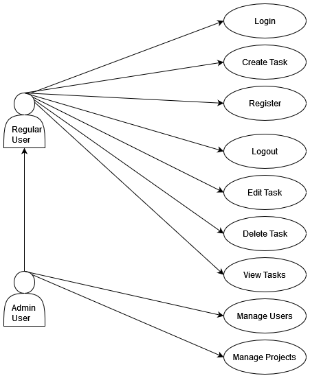
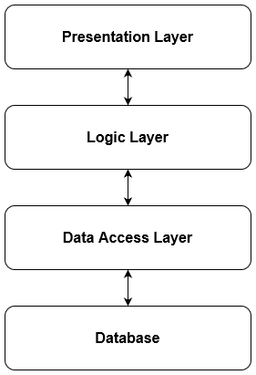

# Software Project Final Report

## Team Members

- Chase Ivanicic
- Bernard Schweter

## Date

12/5/2024

## Table of Contents

1. [Introduction](#introduction)
    1. [Purpose and Scope](#purpose-and-scope)
    2. [Product Overview](#product-overview)
    3. [Structure of the Document](#structure-of-the-document)
    4. [Terms, Acronyms, and Abbreviations](#terms-acronyms-and-abbreviations)
2. [Project Management Plan](#project-management-plan)
    1. [Project Organization](#project-organization)
    2. [Lifecycle Model Used](#lifecycle-model-used)
    3. [Risk Analysis](#risk-analysis)
    4. [Hardware and Software Resource Requirements](#hardware-and-software-resource-requirements)
    5. [Deliverables and Schedule](#deliverables-and-schedule)
3. [Requirement Specifications](#requirement-specifications)
    1. [Stakeholders for the System](#stakeholders-for-the-system)
    2. [Use Cases](#use-cases)
        1. [Graphic Use Case Model](#graphic-use-case-model)
        2. [Textual Description for Each Use Case](#textual-description-for-each-use-case)
    3. [Rationale for Your Use Case Model](#rationale-for-your-use-case-model)
    4. [Non-functional Requirements](#non-functional-requirements)
4. [Architecture](#architecture)
    1. [Architectural Style(s) Used](#architectural-styles-used)
    2. [Architectural Model](#architectural-model)
    3. [Technology, Software, and Hardware Used](#technology-software-and-hardware-used)
    4. [Rationale for Your Architectural Style and Model](#rationale-for-your-architectural-style-and-model)
5. [Design](#design)
    1. [User Interface Design](#user-interface-design)
    2. [Components Design](#components-design)
    3. [Database Design](#database-design)
    4. [Rationale for Your Detailed Design Models](#rationale-for-your-detailed-design-models)
    5. [Traceability from Requirements to Detailed Design Models](#traceability-from-requirements-to-detailed-design-models)
6. [Test Management](#test-management)
    1. [A Complete List of System Test Cases](#a-complete-list-of-system-test-cases)
    2. [Traceability of Test Cases to Use Cases](#traceability-of-test-cases-to-use-cases)
    3. [Techniques Used for Test Case Generation](#techniques-used-for-test-case-generation)
    4. [Test Results and Assessments](#test-results-and-assessments)
    5. [Defects Reports](#defects-reports)
7. [Conclusions](#conclusions)
    1. [Outcomes of the Project](#outcomes-of-the-project)
    2. [Lessons Learned](#lessons-learned)
    3. [Future Development](#future-development)
8. [References](#references)

---

## 1. Introduction

### 1.1 Purpose and Scope

The primary goal of the software is to deliver a lightweight, easy-to-use task management tool that can be accessed through a web portal. The software aims to:
- Provide users with a web-based platform to create, update, delete, and manage tasks effectively.
- Ensure high responsiveness, with task views loading in under 2 seconds for up to 100 tasks.
- Design a scalable and modular architecture that can accommodate future enhancements such as task delegation.

### 1.2 Product Overview

The software will offer a web-based interface that allows users to manage their tasks, including creating, updating, and deleting tasks. Users can categorize tasks, set deadlines, assign priorities, and view upcoming tasks. Core features include:
- **Task Management**: Creating, viewing, editing, and deleting tasks.
- **Task Filtering**: Organizing tasks by categories or priorities.
- **User Authentication**: Secure login, registration, and user role management.

### 1.3 Structure of the Document

The document is organized into sections covering project management, requirement specifications, architecture, design, testing, and conclusions.

### 1.4 Terms, Acronyms, and Abbreviations

- **CRUD**: Create, Read, Update, Delete.
- **UI**: User Interface.
- **API**: Application Programming Interface.
- **FastAPI**: A modern web framework for building APIs with Python.

---

## 2. Project Management Plan

### 2.1 Project Organization

The team consists of two members, Chase Ivanicic and Bernard Schweter, responsible for design, development, testing, and documentation.

### 2.2 Lifecycle Model Used

The project technically used a Waterfall methodology, progressing through distinct phases including requirement gathering, design, implementation, testing, and maintenance. Initially, an Agile methodology was considered, but the development followed a more sequential, phase-based approach typical of Waterfall.

### 2.3 Risk Analysis

Key risks include:
- **Budget Constraint Risk**: The project lacks funding, limiting tool choices. This was mitigated by using free or open-source tools only.
- **Hosting Issues**: Self-hosting the system required careful planning and adequate hardware allocation. Clear documentation was provided to address setup challenges.
- **Scope Creep**: The project might outgrow core functionality. To mitigate this, the team focused on core features with a simple timeline to prevent excessive feature addition.

Expand on the mitigation strategies for risks:
- **Scope Creep**: Enforce strict adherence to core features like task creation, filtering, and management. Use a backlog for non-critical features to prioritize effectively during development.
- **Budget Constraint Risk**: The entire development utilizes open-source tools like FastAPI, PostgreSQL, and self-hosting on a Dell server, minimizing costs.

### 2.4 Hardware and Software Resource Requirements

- **Hardware**: Standard development hardware with Linux/Windows OS and a Dell server for self-hosting.
- **Software**: PostgreSQL, FastAPI, GitHub, and self-hosted deployment.

### 2.5 Deliverables and Schedule

The project deliverables were developed over a one-month timeline, divided into the following tasks:
- **Week 1**: Software requirement specification.
- **Week 2**: Database development and API development.
- **Week 3**: Front-end development.
- **Week 4**: Testing and documentation.

Align this section with the detailed timeline from the project plan:
- **October 10th**: Requirement specification completed.
- **October 20th**: Database and API development finalized.
- **November 1st**: Front-end design completed.
- **November 15th**: Testing and documentation submitted for review.

---

## 3. Requirement Specifications

### 3.1 Stakeholders for the System

- **End Users**: Individuals and small business owners.
- **Administrators**: Responsible for user management and system configuration.

Expand to include details from the requirements document:
- **Regular Users**: Individual users managing personal tasks.
- **Admin Users**: Users managing access and overseeing task operations.
- **Potential Business Use Case**: Small businesses or teams in future versions.

### 3.2 Use Cases

#### 3.2.1 Graphic Use Case Model

#### 3.2.2 Textual Description for Each Use Case

- **Login**: Allows a user to securely access their account by entering their username and password. If the credentials are invalid, an error message will be displayed. 
  - **Actors**: Regular User, Admin User
  - **Preconditions**: User must be registered.
  - **Postconditions**: User is authenticated and redirected to the dashboard.

- **Register**: Enables a new user to create an account by providing required details, such as username, password, and email address. 
  - **Actors**: Regular User
  - **Preconditions**: None.
  - **Postconditions**: User is registered and redirected to the login page.

- **Logout**: Allows a user to securely log out of the system. Any active session will be terminated.
  - **Actors**: Regular User, Admin User
  - **Preconditions**: User must be logged in.
  - **Postconditions**: User session is cleared, and they are redirected to the login page.

- **Create Task**: Enables users to add a new task by providing a title, category, priority, and deadline. Tasks can optionally include a description.
  - **Actors**: Regular User, Admin User
  - **Preconditions**: User must be logged in.
  - **Postconditions**: Task is created and added to the user’s task list.

- **Edit Task**: Allows users to modify an existing task. Users can update the title, category, priority, deadline, or description.
  - **Actors**: Regular User, Admin User
  - **Preconditions**: User must have an existing task to edit.
  - **Postconditions**: Task is updated with new details.

- **Delete Task**: Enables users to remove an existing task. The system prompts for confirmation before deleting the task.
  - **Actors**: Regular User, Admin User
  - **Preconditions**: User must have an existing task to delete.
  - **Postconditions**: Task is permanently removed from the system.

- **View Tasks**: Allows users to view a list of tasks, with options to filter by category, priority, or deadline.
  - **Actors**: Regular User, Admin User
  - **Preconditions**: User must be logged in.
  - **Postconditions**: Task list is displayed.

- **Manage Users**: Allows an admin to manage user accounts. Admins can create, edit, or delete user accounts and assign roles.
  - **Actors**: Admin User
  - **Preconditions**: Admin must be logged in.
  - **Postconditions**: User account is modified as requested.

- **Manage Projects**: Enables admins to organize tasks into projects and assign tasks to users.
  - **Actors**: Admin User
  - **Preconditions**: Admin must be logged in.
  - **Postconditions**: Project is created, updated, or deleted, and tasks are organized accordingly.

- **User Authentication**: Secure login, error handling for invalid credentials, and session timeout.

### 3.3 Rationale for Your Use Case Model

The model emphasizes simplicity and efficiency to support core functionalities.

### 3.4 Non-functional Requirements

- **Performance**: Task views must load in under 2 seconds.
- **Usability**: Designed for ease of use by non-technical users.

Add:
- **Security**: Protect against SQL injections and XSS attacks, as detailed in the test cases.
- **Scalability**: Designed to handle up to 10 concurrent users efficiently.

---

## 4. Architecture

### 4.1 Architectural Style(s) Used

A three-layer architecture:

- **Presentation Layer**: Web-based UI.
- **Logic Layer**: Backend API powered by FastAPI.
- **Data Access Layer**: Handles database interactions via FastAPI and SQLAlchemy.

### 4.2 Architectural Model

The system follows a three-layer architecture, comprising a presentation layer for user interaction, a logic layer for processing tasks, and a data access layer for database operations.
        

    

### 4.3 Technology, Software, and Hardware Used

- **Backend Framework**: FastAPI
- **Database**: PostgreSQL
- **Hosting Platform**: Self-hosted on a Dell server

### 4.4 Rationale for Your Architectural Style and Model

The architecture was chosen for its scalability, modern approach (FastAPI’s asynchronous capabilities), and separation of concerns.

Expand with reasoning for design choices:
- FastAPI's asynchronous capabilities support scalability.
- A layered architecture separates concerns, improving maintainability.

---

## 6. Test Management

### 6.1 A Complete List of System Test Cases

The test plan focuses on core manual testing of the system's essential functionalities, including:
- **Functional Test Cases**: Tests for user authentication (valid and invalid credentials), access controls, form validation, CRUD operations for tasks, session timeout functionality, and error handling.
- **UI Test Cases**: Tests for responsiveness, accessibility, cross-browser compatibility, keyboard navigation, and form submission.
- **Security Test Cases**: Validation against XSS attacks and SQL injection.
- **Usability Test Cases**: Verifies usability of error messages, onboarding experience, and responsiveness on mobile devices.

Integrate the comprehensive test cases from the test plan. For example:
- Functional Test Cases (e.g., TC01 to TC08).
- UI Test Cases (e.g., responsiveness, cross-browser compatibility).
- Security Test Cases (e.g., handling SQL injection and XSS).

### 6.2 Traceability of Test Cases to Use Cases

Test cases are mapped to use cases such as Create Task, Edit Task, and Delete Task. For example, TC01 verifies user authentication, while TC04 ensures form validation for task creation.

### 6.3 Techniques Used for Test Case Generation

Boundary-value analysis, exploratory testing, and user acceptance testing were used to generate test cases.

### 6.4 Test Results and Assessments

Test results showed successful implementation of core functionalities, with defects identified and resolved in areas such as form validation and session management.

### 6.5 Defects Reports

Highlight:
- Session timeout inconsistencies were resolved by implementing stricter timeout policies.
- Form validation errors were fixed to ensure robust user input handling.

---

## 7. Conclusions

### 7.1 Outcomes of the Project

The project successfully implemented core functionalities using FastAPI, ensuring high performance and a modular design. User authentication, task management, and audit logging were completed as planned.

### 7.2 Lessons Learned

Effective planning and regular testing are critical to project success. FastAPI’s asynchronous nature enhanced performance but required additional learning for debugging. The Waterfall approach ensured a structured, phase-wise testing and development process.

### 7.3 Future Development

Expand:
- Add advanced features like task delegation and analytics.
- Consider a mobile application for wider accessibility.

---

## References

- [GitHub Repository](https://github.com/Bernard199/CIS-434-Software-Engineering-Project)
